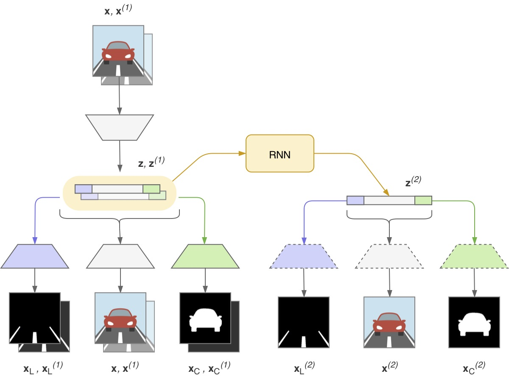
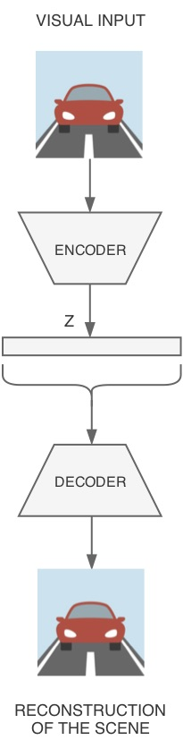
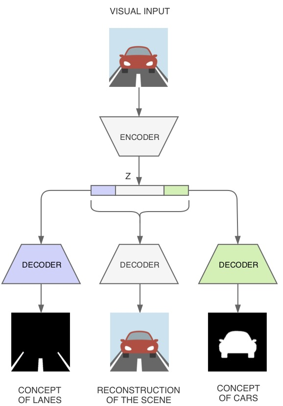
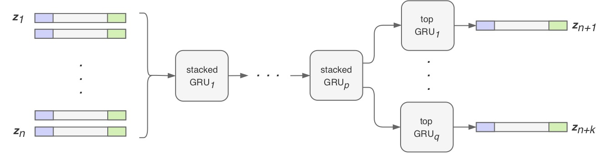
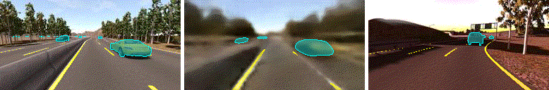
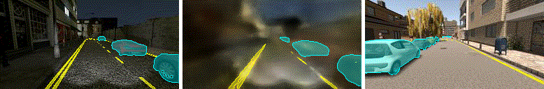

# On the Road with 16 Neurons: Mental Imagery with Bio-inspired Deep Neural Networks

###### *Alice Plebe, Mauro Da Lio (2020).*
---

This repository contains the source code related to the paper *"On the Road with 16 Neurons: Mental Imagery with Bio-inspired Deep Neural Networks"*.
The code is written in Keras using TensorFlow backend.
<!--
The code is written in Keras 2.2.4 using TensorFlow 1.12.0 backend. The scripts are executed with Python 3.6.8. The networks are trained on multiple GPUs with CUDA 10.1.
The neural models obtained from Keras are exported to __Wolfram Mathematica 11.3__ for visualization.
-->



<!--
## Neural architectures

#### Variational autoencoder
The first neural model we developed is a simple variational autoencoder having a single color image as input, and is trained to reconstruct the same image as output, in a totally unsupervised way.


#### Topological autoencoder
A second neural model shares the encoder structure of the previous network, but is trained to explicitly learn in the latent space a compressed representation of the location of cars and lane markings in the scene.

There are 3 different decoders predicting, respectively: a reconstruction of the initial color image, a binary mask indicating the locations of other cars, and a binary mask for the location of lane markings. The 2 "topological" branches of the network require a supervised training, with the use of segmented ground truth. 


#### Temporal autoencoder
The third neural model expands the previous architecture with the inclusion of temporal information. A sequence of frames is fed to a topological autoencoder, which produces a corresponding sequence of latent spaces. This sequence is passed to a reccurent network predicting a new sequence future latent spaces, which are then expanded to images through the same decoder of the topological model.

This architecture is not directed at performing prediction in the long future, but it is trained to obtain a more refined latent representation that takes in consideration also the temporal coherence between frames.


#### Recurrent model
The last set of neural models focuses on long-term prediction of future sequences, using as input/output only the latent representations computed by the temporal autoencoders.
-->

<!--
| Variational AE         | Topological AE          | Temporal AE              |
:-----------------------:|:-----------------------:|:-------------------------:
|  |  |  |

| Recurrent model        |
:-----------------------:|
|  |
-->


<!--
## From Keras to Mathematica
For the sake of convenience, the definition and training of neural networks is done entirely in Keras, which allows a very light coding and wide support from the online community. Also the training on multiple GPUs is easily handled.
Unfortunately, there is no direct way to import in Mathematica a neural model created in Keras. Mathematica supports the import of model weights from _HDF5_ files, but the model architecture must be recreated from scratch using Mathematica.
The downside of this approach is that there is no full compatibility between the neural network modules of Keras and Mathematica. One of the main issues is the different handling of convolution padding, which is done automatically in Keras while in Mathematica is still quite intricate. As a consequence, there seems to be no way to recreate in Mathematica a series of deconvolutional layers as in Keras. So further work is needed.
-->

<!--
## Test results

We train and test our model on the [SYNTHIA](http://synthia-dataset.net/) dataset.

#### Frame recontruction
This are the results of the temporal autoencoder on the *freeway* driving sequences (on the left the model output, on the right the ground thuth):


This are the results on the *city* driving sequences:


#### Interpolation between latent spaces
These are the results of testing the latent spaces computed by the temporal autoencoder model:






#### Hallucination
These are the results of testing the recurrent model using the *hallucination* technique: the predicted output of the recurrent network is fed as input of the next recursive iteration (on the left the imaginary sequence produced by the network, on the right the reference sequence):


-->

## Contents

- `README.md` this file.
- `cnfg/` configuration files.
- `dataset/` structure of folders containing all data used to train the models.
- `imgs/` some visual predictions resulted from different experiments.
- `log/` collection of significant saved trained neural models, and summary tables.
- `math/` various Mathematica scripts for recreation of neural models and visualization.
- `models/` state-of-the-art pretrained models (like VGG16).
- `res/` folder where executions are automatically saved.
- `src/` Python scripts:
	- `arch.py` defines the architectures of neural models,
	- `cnfg.py` handles command line arguments,
	- `exec_dset.py` creates the structures of symlinks for building a dataset,
	- `exec_eval.py` loads and evaluates a saved model,
	- `exec_feat.py` generates dataset of latent space encodings,
	- `exec_lata.py` is a collection of functions to analyze the latent space,
	- `exec_main.py` is the main file to execute training,
	- `gener.py` handles the *Generator* structures for parsing a dataset,
	- `h5lib.py` is a collection of utilities for loading weights from an HDF5 file,
	- `mesg.py` contains utilities for printing error messages,
	- `pred.py` defines a class for non-neural time prediction,
	- `sample_sel.py` contains a dictionary of manually-selected samples of different type of events,
	- `tester.py` collects functions for testing a trained model,
	- `trainer.py` contains the training routine.
- `video/` animations showing the best results.


## Usage
To run the program, execute the main script `src/exec_main.py `. The script supports the following command line arguments:

```
exec_main.py [-h] -c <file> -g <num> [-f <frac>] [-l <model>] [-Ttrsaex]
```

- `-a`, `--accur` execute accuracy evaluation on selected samples (`-a`) or on all test set (`-aa`) *(it may take a while!)*.
- `-c <file>`, `--config <file>` pass a configuration file describing the model architecture and training parameters.
- `-e`, `--eval` execute evaluation routines.
- `-f <frac>`, `--fgpu <frac>` set the fraction of GPU memory to allocate *[default: 0.90]*.
- `-g <num>`, `--gpu <num>` set the number of GPUs to use (0 if CPU) or list of GPU indices.
- `-h`, `--help` show the help message with description of the arguments.
- `-i`, `--intrp` execute interpolation tests.
- `-l <model>`, `--load <model>` pass a folder or a HDF5 file to load as weights or entire model.
- `-p`, `--pred` compute model predictions over a selected set of images.
- `-r`, `--redir` redirect _stderr_ and _stdout_ to log files.
- `-s`, `--save` archive configuration file (`-s`) and python scripts (`-ss`) used.
- `-t`, `--test` execute testing routines.
- `-T`, `--train` execute training of the model.
- `-x`, `--hallx` execute hallucination routines.


As example, run the following command from the upmost `autoencoder/` folder. This command will train a new model on the first two GPUs on the machine. Then it will test the results, save all the files required to reproduce the experiment, and redirect all console messages to log files:

```
$ python src/exec_main.py -c config/cnfg_file -g 0,1 -Ttssr
```

Another example, this command will load an already trained model and will execute all the test routines on CPU:

```
$ python src/exec_main.py -l log/nicemodel/nn_best.h5 -c log/nicemodel/config/cnfg_file -g 0 -taaeipx
```
